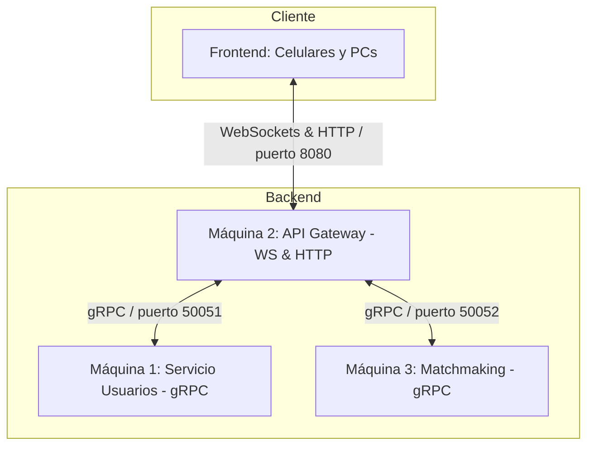
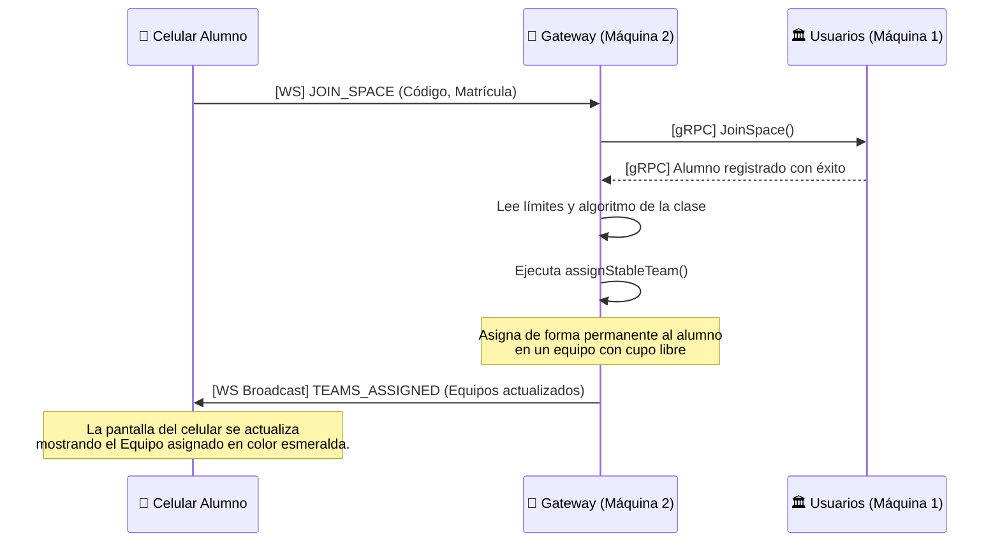

# 🎓 Guía de Estudio Completa: Arquitectura Distribuida TeamSpace

Esta guía ha sido diseñada para servirte como material de estudio y preparación para defensas o exámenes de tu materia de **Sistemas Distribuidos**. Aquí se explica de manera clara y didáctica cómo funciona cada componente, para qué sirve cada línea de código fundamental y dónde ocurre la magia de la **automatización de equipos**.

---

## 🏗️ 1. Arquitectura General del Sistema

TeamSpace es un sistema distribuido que sigue el patrón de **Microservicios**. Se compone de 3 servicios backend independientes (las "Máquinas") que se comunican entre sí utilizando **gRPC**, y una interfaz de usuario (el "Frontend") que se comunica con el Gateway utilizando **WebSockets** y es servido vía **HTTP**.



### 📡 Protocolos de Comunicación Utilizados:
1. **HTTP (Puerto 8080 en M2):** Se utiliza exclusivamente para que los celulares y computadoras descarguen los archivos visuales (`index.html`) al abrir la aplicación.
2. **WebSockets (Puerto 8080 en M2):** Mantiene un "canal bidireccional abierto" entre el navegador de cada usuario y el Gateway. Permite que el servidor envíe datos en tiempo real al instante (reactividad) sin necesidad de recargar la página.
3. **gRPC (Puertos 50051 y 50052):** Protocolo de comunicación interna basado en **HTTP/2** y **Protocol Buffers**. Es extremadamente rápido y eficiente porque transmite datos binarios optimizados en lugar de texto plano JSON.

---

## 📂 2. ¿Para qué sirve cada archivo del proyecto?

### A. 📝 El Contrato: `proto/teamspace.proto`
* **¿Qué es?:** Es el archivo de definición de **Protocol Buffers**. 
* **¿Para qué sirve?:** Actúa como el "contrato de comunicación" oficial del backend. Define exactamente qué funciones se pueden llamar remotamente, qué parámetros necesitan recibir y qué datos deben responder.
* **Estructura clave:**
  - `UserSpaceService` (Máquina 1): Define las RPCs `CreateSpace` (crear clase), `JoinSpace` (unir alumno), `GetSpaceMembers` (obtener lista de alumnos) y `GetSpaceConfig` (obtener configuración).
  - `MatchmakingService` (Máquina 3): Define la RPC `AssignTeams` (dividir en equipos).
  - Mensajes (`message`): Estructuras de datos como `Student` (ID, nombre, joined_at) y `Team` (número, integrantes).

### B. 🏛️ Máquina 1: `maquina1-usuarios/server.js`
* **¿Qué es?:** El servicio de base de datos en memoria y persistencia de espacios y usuarios.
* **¿Para qué sirve?:** Guarda quiénes son los docentes, qué códigos de espacio se han creado y qué alumnos se han registrado en cada materia.
* **Estructuras clave:**
  - `const spaces = new Map();`: Estructura en memoria que guarda pares de `código_de_espacio -> { configuración, alumnos }`.
  - `joinSpace()`: Valida si la clase existe, si la matrícula no está repetida y registra al estudiante agregándolo a la lista del espacio.

### C. 🧠 Máquina 3: `maquina3-matchmaking/server.js`
* **¿Qué es?:** El motor de procesamiento pesado y algoritmos matemáticos del sistema.
* **¿Para qué sirve?:** Es una máquina **"sin estado"** (stateless). No recuerda qué espacios existen ni guarda datos; simplemente toma una lista de alumnos que le envían, aplica la lógica de agrupación solicitada (`RANDOM` u `ORDER`) respetando el límite `max_per_team` y responde con los grupos formados balanceadamente.
* **Estructuras clave:**
  - `fisherYatesShuffle()`: Algoritmo clásico de aleatoriedad pura que baraja a todos los integrantes.
  - `segmentStudents()`: Calcula el número mínimo de equipos requeridos y reparte a los alumnos equitativamente (por ejemplo, si hay 10 alumnos con límite 3, crea 4 equipos de tamaño [3, 3, 2, 2], balanceándolos).

### D. 🔌 Máquina 2 (El Cerebro): `maquina2-gateway/server.js`
* **¿Qué es?:** El **API Gateway** y Orquestador del sistema.
* **¿Para qué sirve?:** Es el único que da la cara al usuario. Mantiene las conexiones WebSockets activas, maneja la sala de comunicación (rooms) de cada espacio para hacer difusiones selectivas (broadcasts), sirve el HTML mediante su servidor HTTP y coordina la lógica interna llamando por gRPC a la Máquina 1 y la Máquina 3.

---

## ⚡ 3. ¿Dónde ocurre la Automatización y cómo funciona?

La automatización completa en tiempo real de la formación de equipos se localiza dentro de **`maquina2-gateway/server.js`**. 

Sucede exactamente en dos partes coordinadas:

### 1. El Algoritmo de "Agrupación Estable e Incremental"
Añadimos la función **`assignStableTeam`** al inicio del Gateway. Su trabajo consiste en emparejar al estudiante que se acaba de unir **sin perturbar a los que ya estaban asignados**:

```javascript
function assignStableTeam(spaceCode, student, maxPerTeam, algorithm) {
  if (!spaceTeams.has(spaceCode)) {
    spaceTeams.set(spaceCode, []);
  }
  const teams = spaceTeams.get(spaceCode);

  // Evitar duplicar al alumno si ya estaba en algún grupo
  const exists = teams.some(t => t.members.some(m => m.student_id === student.student_id));
  if (exists) return teams;

  if (algorithm === "ORDER") {
    // Busca secuencialmente el primer equipo disponible que tenga espacio libre
    let placed = false;
    for (const team of teams) {
      if (team.members.length < maxPerTeam) {
        team.members.push(student);
        placed = true;
        break;
      }
    }
    if (!placed) {
      // Si todos están llenos, crea el siguiente equipo (ej: Equipo 3)
      teams.push({ team_number: teams.length + 1, members: [student] });
    }
  } else {
    // RANDOM: Selecciona aleatoriamente uno de los equipos que tienen cupo.
    // Esto inyecta aleatoriedad pero mantiene intactos a los alumnos ya asignados.
    const availableTeams = teams.filter(t => t.members.length < maxPerTeam);
    if (availableTeams.length > 0) {
      const randomTeam = availableTeams[Math.floor(Math.random() * availableTeams.length)];
      randomTeam.members.push(student);
    } else {
      // Si no hay equipos con espacio, se abre un equipo nuevo
      teams.push({ team_number: teams.length + 1, members: [student] });
    }
  }
  return teams;
}
```

### 2. La Intercepción del Registro (`handleJoinSpace`)
La automatización se detona de manera automática dentro de **`handleJoinSpace`** cuando un alumno envía la solicitud de ingreso:

```javascript
// Ocurre al recibir el mensaje 'JOIN_SPACE' del alumno por WebSocket
async function handleJoinSpace(ws, msg) {
  // 1. Registra al alumno en la persistencia de la Máquina 1 (gRPC)
  const res = await grpcCall(userClient, "JoinSpace", { ... });

  if (res.success) {
    // 2. Notifica a todos que el alumno ingresó ("STUDENT_JOINED")
    broadcastToSpace(code, { type: "STUDENT_JOINED", ... });

    // ── AQUÍ SUCEDE LA AUTOMATIZACIÓN ──
    try {
      // A. Obtiene de inmediato la configuración del espacio (gRPC)
      const configRes = await grpcCall(userClient, "GetSpaceConfig", { space_code: code });
      
      if (configRes.success) {
        // B. Llama a la función estable para acomodar al alumno en un equipo
        const updatedTeams = assignStableTeam(
          code,
          res.student,
          configRes.config.max_per_team,
          configRes.config.algorithm
        );

        // C. Hace broadcast reactivo del resultado a TODOS en el espacio ("TEAMS_ASSIGNED")
        broadcastToSpace(code, {
          type: "TEAMS_ASSIGNED",
          teams: updatedTeams,
          ...
        });
      }
    } catch (assignErr) { ... }
  }
}
```

### 💡 Resumen del Flujo Automático:


---

## ❓ 4. Posibles preguntas en una Defensa de Proyecto

1. **¿Por qué decidieron separar el sistema en microservicios en lugar de un monolito?**
   - *Respuesta:* Para lograr **escalabilidad** y **desacoplamiento**. Si la lógica de algoritmos (Máquina 3) consume mucha CPU calculando emparejamientos masivos, esa máquina puede escalarse o saturarse de forma aislada sin afectar el registro de alumnos (Máquina 1) ni tumbar la conexión WebSocket de los usuarios (Máquina 2).

2. **¿Qué ventajas tiene utilizar gRPC en lugar de APIs REST tradicionales para la comunicación interna?**
   - *Respuesta:* gRPC utiliza **HTTP/2**, lo cual permite multiplexación de conexiones (múltiples llamadas sobre el mismo canal de red) y serialización binaria con **Protocol Buffers**. Esto disminuye el consumo de ancho de banda y latencia de red en comparación con serializar y transmitir texto JSON pesado mediante solicitudes REST tradicionales.

3. **¿Cómo garantizan que la asignación automática no mueva a los alumnos de equipo constantemente?**
   - *Respuesta:* Mediante una **caché estable e incremental** administrada en el Gateway. En lugar de barajar y reorganizar de nuevo a todo el conjunto de alumnos en cada unión, el Gateway evalúa a los alumnos asignados y al nuevo integrante de forma aislada, insertando secuencial o aleatoriamente al nuevo en los huecos sobrantes, manteniendo a los compañeros previos en su sitio original de por vida.
